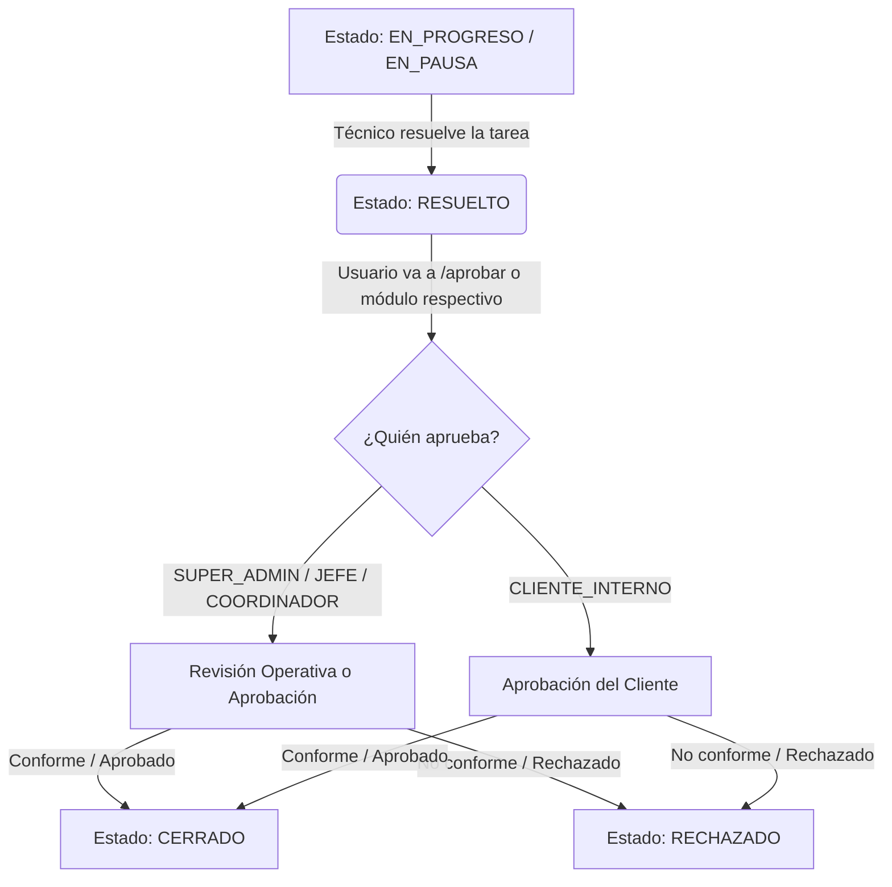

# Análisis Técnico del Flujo de Aprobación por Cliente y Conformidad

Este documento presenta un diagnóstico detallado del flujo actual de aprobación y conformidad por parte del cliente en el frontend y backend del sistema. Su objetivo es identificar inconsistencias, definir la separación conceptual de flujos (revisión operativa, aprobación cliente y cierre administrativo) y establecer las bases técnicas antes de proceder con cualquier refactorización.

---

## 1. Flujo Actual Completo

El ciclo de vida del estado de resolución y aprobación opera bajo la siguiente secuencia técnica:

### Detalles del Flujo Técnico
*   **Estado Inicial:** La tarea debe estar en estado `RESUELTO`.
*   **Quién cambia a RESUELTO:** El técnico responsable asignado al ticket (también un supervisor/admin puede marcarla como resuelta si está asignado como responsable).
*   **Quién puede aprobar:** 
    *   Supervisores (`SUPER_ADMIN`, `JEFE_MTTO`, `COORDINADOR_MTTO`) para cualquier tarea del sistema.
    *   Clientes (`CLIENTE_INTERNO`) únicamente para las tareas que ellos mismos reportaron (`creadorId === user.id`).
*   **Quién puede rechazar:** Mismas reglas que la aprobación (Supervisores para todo, Clientes para sus propios reportes).
*   **Estado resultante al aprobar:** `CERRADO`.
*   **Estado resultante al rechazar:** `RECHAZADO` (el ticket se reabre y regresa al flujo del técnico; si lo rechaza un supervisor, se exige una nueva fecha de vencimiento).
*   **Endpoint utilizado:**
    *   *Individual:* `PATCH /api/tickets/:id/status` (enviando `estado`, `nota`, `fechaVencimiento` e `imagenes` en FormData).
    *   *Lote (Solo supervisores):* `PATCH /api/tickets/approve-batch` (enviando `ticketIds` y `nota` en JSON).

---

## 2. Matriz de Roles y Permisos de Estatus

| Rol | Puede Resolver | Puede Aprobar | Puede Rechazar | Puede Cerrar Admin | Observaciones |
| :--- | :---: | :---: | :---: | :---: | :--- |
| **SUPER_ADMIN** | Sí *(si es responsable)* | Sí *(cualquiera)* | Sí *(cualquiera)* | Sí *(cualquiera)* | Control total del sistema. |
| **JEFE_MTTO** | Sí *(si es responsable)* | Sí *(cualquiera)* | Sí *(cualquiera)* | Sí *(cualquiera)* | Permisos equivalentes al Administrador. |
| **COORDINADOR_MTTO** | Sí *(si es responsable)* | Sí *(cualquiera)* | Sí *(cualquiera)* | Sí *(cualquiera)* | Permisos equivalentes al Administrador. |
| **TECNICO** | Sí *(si es responsable)* | No | No | No | Solo resuelve. No cierra (salvo `RUTINA` o `INSPECCION` que auto-cierran). |
| **CLIENTE_INTERNO** | No | Sí *(solo sus reportes)* | Sí *(solo sus reportes)* | No | Solo actúa sobre tareas creadas por él que estén en `RESUELTO`. |

---

## 3. Mapeo de Componentes Frontend

| Módulo | Vista | Modal / Formulario | Acción | Estado Origen | Estado Destino | ¿Usa Firma? | Observaciones |
| :--- | :--- | :--- | :--- | :---: | :---: | :---: | :--- |
| **Aprobaciones** | `/aprobar` *(Desktop)* | `TicketReviewModal` *(tickets)* | Aprobación/Rechazo | `RESUELTO` | `CERRADO` / `RECHAZADO` | **NO** | Usa el modal genérico de tickets, por lo que **no pide firma** incluso si la tarea es de maquinaria. |
| **Aprobaciones** | `/aprobar` *(Mobile)* | `TicketReviewModal` *(tickets)* | Aprobación/Rechazo | `RESUELTO` | `CERRADO` / `RECHAZADO` | **NO** | Mismo modal genérico que desktop. |
| **Mantenimientos** | Desktop | `MantenimientosReviewModal` | Revisión Operativa | `RESUELTO` | `CERRADO` / `RECHAZADO` | **SÍ** | Exige firma de conformidad en pantalla si la tarea es de maquinaria (`esMaquinaria`). |
| **Mantenimientos** | Mobile | `MobileMantenimientosReviewModal` | Revisión Operativa | `RESUELTO` | `CERRADO` / `RECHAZADO` | **NO** | No tiene el canvas de firma en código móvil. |
| **Tickets** | Desktop / Mobile | `TicketReviewModal` / `MobileTicketReviewModal` | Revisión Operativa | `RESUELTO` | `CERRADO` / `RECHAZADO` | **NO** | Flujo estándar de reportes generales. |
| **Hoy** *(Todas)* | Desktop | `TicketReviewModal` *(tickets)* | Revisión Operativa | `RESUELTO` | `CERRADO` / `RECHAZADO` | **NO** | **Inconsistencia:** No mapea al modal de mantenimientos para tareas con máquina; se aprueban sin firma. |
| **Hoy** *(Mantto)* | Desktop | `HoyReviewModal` -> `MantenimientosReview` | Revisión Operativa | `RESUELTO` | `CERRADO` / `RECHAZADO` | **SÍ** | Selecciona dinámicamente el modal con firma. |
| **Hoy** *(Mantto)* | Mobile | `MobileMantenimientosReviewModal` | Revisión Operativa | `RESUELTO` | `CERRADO` / `RECHAZADO` | **NO** | Usa el modal móvil de mantenimientos (sin firma). |
| **Hoy** *(Activid)* | Desktop / Mobile | `HoyReviewModal` -> `TicketsReview` | Revisión Operativa | `RESUELTO` | `CERRADO` / `RECHAZADO` | **NO** | Flujo de actividades generales. |

---

## 4. Mapeo de Funciones Backend

| Archivo | Función | Rol / Flujo | Validaciones Principales | Endpoint | Observaciones |
| :--- | :--- | :--- | :--- | :--- | :--- |
| `05_status.ts` | `changeTicketStatus` | Despachador | Valida rol del token y desvía al controlador específico. | `PATCH /api/tickets/:id/status` | Dispatcher limpio sin lógica de base de datos. |
| `status_tecnico.ts` | `changeStatusTecnico` | Técnico | Valida que sea asignado. Impide cerrar tareas que no sean `RUTINA` o `INSPECCION`. | (Despachado) | Procesa registro de tiempo y refacciones. |
| `status_cliente.ts` | `changeStatusCliente` | Cliente | Valida que `creadorId === user.id`, estado inicial `RESUELTO` y destino `CERRADO` o `RECHAZADO`. | (Despachado) | No permite registrar tiempos ni refacciones. |
| `status_admin.ts` | `changeStatusAdmin` | Admin / Jefe | Si es `cierreAdministrativo`, obliga a enviar una nota. Si es operativo, valida que sea responsable. | (Despachado) | Permite registrar tiempos, refacciones y nueva fecha de vencimiento. |
| `_core.ts` | `ejecutarCambioEstado` | Común | Valida interlocks de máquina y registra intervalos de tiempo en la DB. | (Despachado) | **No realiza ninguna validación de firmas.** |
| `07_approve_batch.ts`| `approveTicketsBatch` | Admin / Jefe | Valida que las tareas estén en `RESUELTO`. | `PATCH /api/tickets/approve-batch`| Registra el cambio de estado masivo en el historial. |

---

## 5. Diferencia entre Revisión Operativa, Aprobación Cliente y Cierre Administrativo

| Criterio | Revisión Operativa Interna | Aprobación / Conformidad Cliente | Cierre Administrativo |
| :--- | :--- | :--- | :--- |
| **Quién lo usa** | Supervisor de Mantenimiento | Cliente Solicitante / Dueño de Área | Administrador / Jefe de Mantenimiento |
| **Dónde vive** | Módulos de Mantenimientos / Hoy | Bandeja de Aprobaciones (`/aprobar`) | Modal de Detalle (Acción de Gestión) |
| **Estado origen** | `RESUELTO` | `RESUELTO` | Cualquiera (`PENDIENTE`, `EN_PROGRESO`, etc.) |
| **Estado destino** | `CERRADO` o `RECHAZADO` | `CERRADO` o `RECHAZADO` | `CERRADO` (Forzado) |
| **Modal utilizado** | `MantenimientosReviewModal` | `TicketReviewModal` (Genérico) | `AdminCloseModal` |
| **¿Debe pedir firma?**| **NO.** Es una verificación puramente técnica del trabajo. | **SÍ.** Representa el finiquito y aceptación formal del cliente. | **NO.** Es un desbloqueo manual de gestión (ej. tareas duplicadas/canceladas). |

---

## 6. Diagnóstico de Firma y Conformidad

Actualmente, **no existe un flujo de firma real alineado en la aprobación del cliente**. El comportamiento del sistema es el siguiente:

1.  **Captura equivocada:** La firma se captura únicamente en el modal de **Revisión Operativa de Mantenimiento (Desktop)**, en lugar del flujo de **Aprobación del Cliente**.
2.  **Almacenamiento genérico:** La firma no tiene un campo dedicado en la base de datos (como `firmaUrl` o similar). Se captura como un `Blob` de imagen, se nombra `"firma_conformidad.png"` en el frontend, y se envía en el arreglo general de imágenes (`imagenes`), subiéndose a Cloudinary como un archivo adjunto cualquiera.
3.  **Cero validación en backend:** El backend desconoce por completo el concepto de firmas. No valida nombres de archivo ni la presencia de evidencias en el endpoint.
4.  **Bypass simple:** Un usuario (o script) puede enviar un cambio de estado a `CERRADO` directamente al endpoint de la API sin enviar archivos y la base de datos lo procesará con éxito.
5.  **Alcance:** Solo se solicita en mantenimientos preventivos y correctivos de maquinaria (`maquinaId !== null`) en la vista de escritorio del módulo de mantenimientos.

---

## 7. Inconsistencias Detectadas (Filtro Aprobación)

### INC-01: Concepto de Conformidad Filtrado en el Modal de Supervisor
*   **Severidad:** Alta
*   **Archivos involucrados:** 
    *   `src/features/mantenimientos/components/common/mantenimientos-review-modal.jsx`
*   **Impacto real para usuario:** El supervisor es forzado a firmar o solicitar una firma física dentro de su pantalla técnica de revisión en Desktop, mientras que en la bandeja de aprobación del cliente real (`/aprobar`) no existe forma de firmar.
*   **Riesgo técnico:** Acoplamiento de responsabilidades. Si el cliente quiere aprobar de forma remota desde su cuenta, no puede firmar digitalmente.
*   **Recomendación:** Mover el componente `SignaturePad` del modal de revisión de mantenimientos hacia el modal utilizado en la bandeja `/aprobar`.
*   **Corregir ahora:** No (Fase de diseño posterior).

### INC-02: Disparidad de Firmas Desktop/Mobile en Mantenimientos
*   **Severidad:** Alta
*   **Archivos involucrados:** 
    *   `src/features/mantenimientos/components/common/mantenimientos-review-modal.jsx`
    *   `src/features/mantenimientos/components/common/mobile-mantenimientos-review-modal.jsx`
*   **Impacto real para usuario:** A un supervisor en computadora no se le permite cerrar un mantenimiento de maquinaria sin firma, pero si usa su teléfono móvil, puede cerrarlo al instante sin requerir firma alguna.
*   **Riesgo técnico:** Inconsistencia en reglas de negocio y calidad de los datos recopilados en campo.
*   **Recomendación:** Una vez redefinido dónde debe vivir la firma (en aprobación cliente), asegurar que la vista móvil y de escritorio de dicho flujo compartan la misma lógica de validación.
*   **Corregir ahora:** No.

### INC-03: Aprobación sin Firma en Bandeja `/aprobar` para Mantenimientos
*   **Severidad:** Alta
*   **Archivos involucrados:** 
    *   `src/features/aprobar/pages/aprobar-pages.jsx`
*   **Impacto real para usuario:** Cuando un cliente/supervisor entra a `/aprobar` y decide cerrar un mantenimiento de maquinaria, el sistema abre `TicketReviewModal` (genérico), saltándose por completo la solicitud de la firma de conformidad.
*   **Riesgo técnico:** Evasión completa de las reglas de negocio de maquinaria.
*   **Recomendación:** Hacer que `/aprobar` identifique si la tarea tiene `maquinaId` y, en ese caso, monte un modal que contenga la firma de conformidad (o unifique el modal de revisión).
*   **Corregir ahora:** No.

### INC-04: Cierre sin Firma desde "Hoy Todas" en Desktop
*   **Severidad:** Media
*   **Archivos involucrados:** 
    *   `src/features/hoy/components/hoy-todas/hoy-ticket-table.jsx`
*   **Impacto real para usuario:** En el dashboard de "Hoy Todas", al hacer clic en "Revisar" sobre un mantenimiento preventivo de maquinaria, se levanta el modal genérico de tickets sin firma, permitiendo cerrarlo sin firmar.
*   **Riesgo técnico:** Fugas de validación según el submódulo desde el cual se opere.
*   **Recomendación:** Unificar el despachador de modales en `Hoy` para usar siempre `HoyReviewModal` en todos los tabs (incluyendo "Todas").
*   **Corregir ahora:** No.

### INC-05: Copia y Pega Masivo de Modales de Revisión (Logic Drift)
*   **Severidad:** Media
*   **Archivos involucrados:**
    *   `src/features/tickets/components/historico/ticket-review-modal.jsx`
    *   `src/features/tickets/components/historico/mobile-ticket-review-modal.jsx`
    *   `src/features/mantenimientos/components/common/mantenimientos-review-modal.jsx`
    *   `src/features/mantenimientos/components/common/mobile-mantenimientos-review-modal.jsx`
*   **Impacto real para usuario:** Diferencias en el comportamiento visual, carga de refacciones, visualización de tiempos y textos entre pantallas.
*   **Riesgo técnico:** Mantenibilidad extremadamente difícil. Cualquier cambio en el flujo de aprobación debe replicarse manualmente en 4 archivos independientes que tienen ligeras variaciones de nombres y estilos.
*   **Recomendación:** Unificar los modales de revisión en un único componente base reutilizable (ej. `ReviewModalBase` en `common`) y parametrizarlo según el scope de la tarea (maquinaria vs general) y el layout (desktop vs mobile).
*   **Corregir ahora:** No.

---

## 8. Recomendaciones de Arquitectura para la Matriz / Unificación

1.  **Separación Limpia de Modales:**
    *   **Revisión Operativa:** Debe enfocarse en la validación técnica del trabajo (refacciones usadas, notas técnicas, tiempos reales, y si la máquina quedó operativa). No debe pedir firmas.
    *   **Aprobación Cliente (Conformidad):** Debe enfocarse en la satisfacción del solicitante (nota de conformidad y firma digital de aceptación).
2.  **Campo dedicado para la Conformidad:**
    *   En lugar de meter la firma de conformidad en el campo `imagenes` del ticket, se debería guardar en un campo explícito (ej. `firmaConformidadUrl`) en el modelo `Tarea` del backend. Esto facilitará reportes de auditoría y evitará que la firma se confunda con fotos del trabajo.
3.  **Unificación de Modales de Aprobación en `/aprobar`:**
    *   Crear un componente unificado `ClientApprovalModal` para el flujo de conformidad. Si el ticket a aprobar corresponde a maquinaria, este modal renderiza el canvas de firma (tanto en Desktop como en Mobile).

---

## 9. Decisiones Pendientes (Para Joel)

Antes de pasar al diseño de formularios comunes o migración de componentes, se requiere alinear los siguientes puntos de negocio:

1.  **¿La firma de conformidad la ingresa el cliente en su propio dispositivo o el técnico le presta su móvil para firmar en caliente?**
    *   *Opción A:* El técnico le presta el móvil. (En este caso, la firma sí debe vivir en el modal de revisión móvil del técnico/supervisor).
    *   *Opción B:* El cliente entra a su bandeja `/aprobar` desde su propia cuenta y firma allí. (En este caso, la firma debe vivir en el modal de aprobación de cliente, no en el del técnico).
2.  **¿Queremos un campo dedicado en base de datos para la firma?**
    *   *Recomendación:* Sí, para evitar mezclar la firma con las fotos de evidencia técnica.
3.  **¿Qué ocurre si el supervisor aprueba una tarea en lote?**
    *   Si se aprueban 10 tareas de maquinaria en lote, ¿se omite la firma o se exige una firma única? (Actualmente el endpoint de lote se salta cualquier firma).
