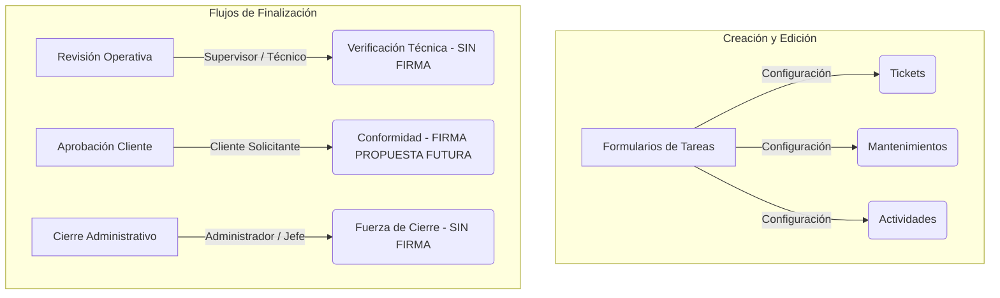

# Diseño Final de Arquitectura: `common/forms` (V2)

Este documento define la propuesta técnica y arquitectónica final para unificar, desacoplar y estructurar de manera mantenible los formularios y flujos de revisión de tareas del sistema en `src/features/common/forms`. Este diseño se fundamenta en la auditoría del frontend, reglas de negocio reales del sistema y los flujos de conformidad documentados en las fases previas.

---

## 1. Estructura de Directorios Propuesta

La arquitectura se centrará en un modelo modular e impulsado por configuración (*configuration-driven forms*) ubicado bajo `src/features/common/forms/tareas`.

```
src/features/common/forms/tareas
├── configs/            # Archivos de configuración estática por módulo/flujo
├── fields/             # Inputs y controles atómicos reutilizables (UI y estado local)
├── sections/           # Agrupaciones lógicas de campos y bloques dinámicos
├── validation/         # Reglas de validación comunes, esquemas Zod o validadores manuales
├── adapters/           # Funciones adaptadoras para normalizar payloads de entrada y salida
├── hooks/              # Hooks personalizados para centralizar estados complejos y lógica API
├── review-operativo/   # Componentes y modales de revisión técnica (sin firma)
├── aprobacion-cliente/ # Vistas y modales de conformidad del cliente (firma digital / fase futura)
└── cierre-admin/       # Modal de cierre forzado administrativo (nota obligatoria, sin firma)
```

### Justificación de cada directorio:
1.  **`configs/`:** Declaraciones estáticas en JS que definen el comportamiento de cada formulario en base a su contexto (ej: qué campos renderizar, qué validaciones disparar, etc.). Evita el uso de lógica condicional (*if/else*) anidada en componentes comunes.
2.  **`fields/`:** Componentes de entrada individuales (ej: `TituloField.jsx`, `MaquinaField.jsx`). Garantiza homogeneidad visual y comportamiento unificado.
3.  **`sections/`:** Componentes compuestos que manejan lógica y campos dependientes (ej: `RecurrenciaSection.jsx` que acopla selección de periodicidad, días y lógica de fechas).
4.  **`validation/`:** Módulos de lógica pura encargados de comprobar la validez de los formularios.
5.  **`adapters/`:** Transforma la salida del formulario al formato esperado por los diferentes endpoints (`FormData` o JSON) y viceversa para la edición de registros.
6.  **`hooks/`:** Orquesta el ciclo de vida del formulario (carga de datos, validaciones y submit). Reduce el código repetido en vistas móviles y de escritorio.
7.  **`review-operativo/`:** Modales operativos sin firma de conformidad (utilizados por supervisores y técnicos para cerrar o rechazar tareas).
8.  **`aprobacion-cliente/`:** Componentes de conformidad (bandeja `/aprobar`). La captura de firma de conformidad cliente se planifica en esta carpeta para una fase futura / decisión pendiente de negocio.
9.  **`cierre-admin/`:** Lógica de cierre administrativo forzado (exclusivo para supervisores/admin con nota obligatoria).

---

## 2. Separación Conceptual de Flujos

Para evitar que los formularios crezcan de forma desmedida o mezclen lógicas incompatibles, se delimitan estrictamente cuatro grupos conceptuales:



1.  **Formularios de Creación / Edición:** Encargados del alta e inicialización de tareas. Su visibilidad y validaciones dependen enteramente del archivo de configuración cargado.
2.  **Formularios / Modales de Revisión Operativa:** Utilizados por supervisores y técnicos para cerrar o rechazar técnicamente una tarea en estado `RESUELTO`. **Bajo ninguna circunstancia deben solicitar firmas de conformidad.**
3.  **Aprobación / Conformidad Cliente:** Flujo y componentes específicos del panel del cliente (ej. bandeja `/aprobar`). Actualmente no cuenta con firma implementada. La firma de conformidad es una propuesta para futuras fases y no bloqueará la arquitectura inicial.
4.  **Cierre Administrativo:** Acción rápida de gestión exclusiva para administradores. Permite mover cualquier tarea a `CERRADO` (ej. tareas obsoletas o canceladas). **No pide firma y requiere motivo justificado de cierre (nota obligatoria).**

---

## 3. Matriz de Configuraciones por Módulo (12 Configs)

A continuación, se detalla la configuración que consumirá el motor de formularios para cada una de las 12 variantes operativas reales del sistema:

| Propiedad / Config | 1. Tickets General | 2. Tickets Actividades | 3. Tickets Reportes | 4. Mantenimientos Preventivos | 5. Mantenimientos Correctivos | 6. Mantenimientos Histórico |
| :--- | :--- | :--- | :--- | :--- | :--- | :--- |
| **tipoFlujo** | `CREAR_EDICION` | `CREAR_EDICION` | `CREAR_EDICION` | `CREAR_EDICION` | `CREAR_EDICION` | `CREAR_EDICION` |
| **moduloOrigen** | `TICKETS` | `TICKETS` | `TICKETS` | `MANTENIMIENTOS` | `MANTENIMIENTOS` | `MANTENIMIENTOS` |
| **permiteCrear** | Sí | Sí | **No** | Sí | Sí | Sí |
| **permiteEditar** | Sí | Sí | Sí | Sí | Sí | Sí |
| **permiteRevisar** | Sí | Sí | Sí | Sí | Sí | Sí |
| **permiteAprobarCliente** | No | No | No | No | No | No |
| **permiteCierreAdmin** | Sí | Sí | Sí | Sí | Sí | Sí |
| **clasificacionesPermitidas**| `RUTINA` | `RUTINA` | N/A | `PREVENTIVO` | `CORRECTIVO` | `PREVENTIVO`, `CORRECTIVO`, `RUTINA` |
| **categoriasPermitidas** | Todas | Todas | Todas | `MAQUINARIA` | `MAQUINARIA` | `MAQUINARIA` |
| **requiereMaquina** | No | No | No | Sí | Sí | Sí *(si es maquinaria)* |
| **permiteMaquina** | Sí *(No maquinaria)*| No | Sí *(No maquinaria)*| Sí | Sí | Sí |
| **permiteRecurrencia** | No | No | No | Sí | **No** | Sí *(solo si es preventivo)* |
| **permiteParoProduccion** | Sí | No | Sí | Sí | Sí | Sí |
| **permiteImpactoProduccion**| Sí | No | Sí | Sí | Sí | Sí |
| **permiteResponsablesMultiples**| Sí | No | Sí | Sí | Sí | Sí |
| **requiereResponsable** | No | No | No | Sí | Sí | Sí |
| **requiereFecha** | No | No | No | Sí | Sí | Sí |
| **permiteFechaPasada** | No | No | No | No | No | No *(en nuevas fechas)* |
| **submitAdapter** | `submitTicketGeneral` | `submitActividad` | `submitEdicionTicket` | `submitMantenimiento` / `submitMantenimientoRecurrente` | `submitMantenimiento` | `submitMantenimiento` / `submitMantenimientoRecurrente` |
| **endpoint** | `/api/tickets` | `/api/tickets` | `/api/tickets/:id` | `/api/tickets` *(normal)*<br>`/api/recurrencias` *(recurrente)* | `/api/tickets` | `/api/tickets` / `/api/recurrencias` |
| **payloadType** | `FormData` | `FormData` | `FormData` | `FormData` *(normal)*<br>`JSON` *(recurrente)* | `FormData` | `FormData` *(normal)*<br>`JSON` *(recurrente)* |
| **mobileComponent** | `MobileTicketFormModal` | `MobileTicketFormModal` | `MobileTicketFormModal` | `MobileMantenimientosFormModal`| `MobileMantenimientosFormModal`| `MobileMantenimientosFormModal` |
| **desktopComponent** | `TicketFormModal` | `TicketFormModal` | `TicketFormModal` | `MantenimientosFormModal` | `MantenimientosFormModal` | `MantenimientosFormModal` |
| **reglasEspeciales** | Bloquear `PREVENTIVO` y `CORRECTIVO` | Auto-asignar tipo `PLANEADA` | Solo permite **Edición** | Recurrencia activa switch especial | Máquina obligatoria al iniciar | Historial completo de mantenimientos |

---

### Matriz de Configuraciones (Continuación)

| Propiedad / Config | 7. Hoy Todas | 8. Hoy Actividades | 9. Hoy Mantenimientos | 10. Calendario | 11. Maquinaria Recurrencias | 12. Aprobación Cliente |
| :--- | :--- | :--- | :--- | :--- | :--- | :--- |
| **tipoFlujo** | `LEER_LISTADO` | `LEER_LISTADO` | `LEER_LISTADO` | `ORQUESTACION` | `CREAR_EDICION` | `REVISAR_CLIENTE` |
| **moduloOrigen** | `HOY` | `HOY` | `HOY` | `CALENDARIO` | `MAQUINARIA` | `APROBACIONES` |
| **permiteCrear** | Sí *(Wrapper)* | Sí *(Wrapper)* | Sí *(Wrapper)* | Sí *(Enruta)* | Sí | No |
| **permiteEditar** | Sí *(Wrapper)* | Sí *(Wrapper)* | Sí *(Wrapper)* | Sí *(Enruta)* | Sí | No |
| **permiteRevisar** | Sí *(Wrapper)* | Sí *(Wrapper)* | Sí *(Wrapper)* | Sí *(Enruta)* | No | Sí |
| **permiteAprobarCliente** | No | No | No | No | No | Sí |
| **permiteCierreAdmin** | Sí | Sí | Sí | Sí | No | No |
| **clasificacionesPermitidas**| `PREVENTIVO`, `CORRECTIVO`, `RUTINA` | `RUTINA` | `PREVENTIVO`, `CORRECTIVO` | `PREVENTIVO`, `CORRECTIVO`, `RUTINA` | `PREVENTIVO` | `PREVENTIVO`, `CORRECTIVO`, `RUTINA` |
| **categoriasPermitidas** | Todas | Todas | `MAQUINARIA` | Todas | `MAQUINARIA` | Todas |
| **requiereMaquina** | No | No | Sí | No | Sí | No |
| **permiteMaquina** | Sí | No | Sí | Sí | Sí | Sí |
| **permiteRecurrencia** | No | No | Sí *(Wrapper)* | Sí *(Enruta)* | Sí | No |
| **permiteParoProduccion** | Sí | No | Sí | Sí | No | No |
| **permiteImpactoProduccion**| Sí | No | Sí | Sí | No | No |
| **permiteResponsablesMultiples**| Sí | No | Sí | Sí | Sí | No |
| **requiereResponsable** | No | No | Sí | No | Sí | No |
| **requiereFecha** | No | No | Sí | Sí | Sí | No |
| **permiteFechaPasada** | No | No | No | No | No | No |
| **submitAdapter** | Enruta según origen | Enruta según origen | Enruta según origen | Enruta según origen | `submitMantenimientoRecurrente` | `submitAprobacionCliente` |
| **endpoint** | Enruta según origen | Enruta según origen | Enruta según origen | Enruta según origen | `/api/recurrencias` | `/api/tickets/:id/status` |
| **payloadType** | `FormData` / `JSON` | `FormData` | `FormData` / `JSON` | Enruta según origen | `JSON` | `JSON` *(Firma propuesta futura)* |
| **mobileComponent** | `MobileTicketFormModal` / `MobileMantenimientosFormModal` | `MobileTicketFormModal` | `MobileMantenimientosFormModal` | Enruta según origen | `MobileRecurrenciaForm` | `AprobarMobile` (usa `TicketReviewModal`) |
| **desktopComponent** | `TicketFormModal` / `MantenimientosFormModal` | `TicketFormModal` | `MantenimientosFormModal` | Enruta según origen | `MaquinaRecurrenciaFormModal` | `AprobarDesktop` (usa `TicketReviewModal`) |
| **reglasEspeciales** | Delega modales dinámicamente | Filtra no-mantenimientos | Solo mantenimientos operativos | Enruta clics a config según tipo | Asociado a ficha de maquinaria | **Firma de conformidad pendiente / futura fase** |

---

## 4. Componentes Comunes Sugeridos

Aislar campos y lógica agilizará el mantenimiento y garantizará una única fuente de verdad visual y lógica:

### 4.1. Fields (Entradas Atómicas)
*   **`TituloField.jsx`:** Input de texto con límites de caracteres (3-255) y validación de espacios vacíos.
*   **`DescripcionField.jsx`:** Textarea de descripción enriquecida o texto plano.
*   **`PrioridadField.jsx`:** Selector de prioridad (`BAJA`, `MEDIA`, `ALTA`, `CRITICA`).
*   **`FechaVencimientoField.jsx`:** Calendario que bloquea dinámicamente fechas del pasado.
*   **`PlantaAreaField.jsx`:** Selectores en cascada para filtrar Planta (Kappa/Alpha) y sus respectivas Áreas.
*   **`ResponsablesField.jsx`:** Componente de selección múltiple de técnicos, con avatares e indicadores de carga de trabajo.
*   **`MaquinaField.jsx`:** Selector buscador autocompletable con estatus operativo y criticidad de la máquina.
*   **`EvidenciasField.jsx`:** Drag-and-drop para cargar archivos fotográficos de antes/después.
*   **`TiempoEstimadoField.jsx`:** Input de duración en minutos con formateador a horas/minutos amigable.
*   **`HorarioProgramadoField.jsx`:** Rango de horas (inicio/fin) para tareas agendadas.

### 4.2. Sections (Bloques Temáticos)
*   **`MaquinariaSection.jsx`:** Agrupa `MaquinaField`, switch de `ParoProduccion` e input de `ImpactoProduccion`.
*   **`RecurrenciaSection.jsx`:** Lógica de recurrencias (días de la semana, intervalo de semanas, y fin de recurrencia).
*   **`ParoProduccionSection.jsx`:** Visualización de advertencias cuando una máquina crítica se detiene.
*   **`RechazoSection.jsx`:** Formulario de nota de rechazo y asignación de nueva fecha de vencimiento.
*   **`EvidenciasResolucionSection.jsx`:** Galería para auditoría de fotos subidas por el técnico.
*   **`RefaccionesSection.jsx`:** Panel interactivo para agregar repuestos usados (con buscador de almacén y cantidades).

### 4.3. Validation (Reglas y Esquemas)
*   **`validateFechaNoPasada`:** Impide ingresar fechas previas al día de hoy en la zona horaria del cliente.
*   **`validateResponsables`:** Garantiza al menos 1 responsable si la tarea no es de tipo reporte rápido.
*   **`validateMaquinaRequerida`:** Obliga a seleccionar máquina válida en clasificaciones de mantenimiento.
*   **`validateTicketGeneral`:** Valida que el ticket no contenga clasificación `PREVENTIVO` ni `CORRECTIVO`.

### 4.4. Submit Adapters (Formateadores de Payload)
*   **`submitTicketGeneral`:** Genera un `FormData` excluyendo campos de maquinaria.
*   **`submitActividad`:** Genera un `FormData` excluyendo campos de maquinaria.
*   **`submitMantenimiento`:** Construye un `FormData` incluyendo la máquina y el paro de producción.
*   **`submitMantenimientoRecurrente`:** Genera estructura anidada JSON para `/api/recurrencias`.
*   **`submitAprobacionCliente`:** Estructura JSON para `/api/tickets/:id/status` (sin firma en fase inicial; firma digital se programará como soporte a futuro).

---

## 5. Reglas del Sistema (Leyes de la Arquitectura)

1.  **Bloqueo de Tipo en Tickets:** No se permite crear clasificaciones PREVENTIVO ni CORRECTIVO desde el formulario genérico de Tickets.
2.  **Mantenimientos exclusivos:** Las tareas preventivas y correctivas de maquinaria son exclusivas del módulo de Mantenimientos o flujos parametrizados con su respectiva config.
3.  **Calendario Desacoplado:** El calendario no posee formularios incrustados obsoletos; opera como un enrutador que inyecta los configs comunes correspondientes al hacer clic en un evento.
4.  **Hoy sin Duplicación:** Las vistas de "Hoy" delegan en wrappers que consumen los componentes comunes parametrizados por config.
5.  **Revisión Operativa Limpia:** Ningún modal de revisión operativa (supervisor-técnico) solicita o exige firmas en el flujo actual.
6.  **Aprobación Cliente Aislada:** Flujo que vive exclusivamente en `/aprobar` y posee su propio modal. La firma de conformidad no está implementada y queda reservada como una mejora futura.
7.  **Cierre Administrativo Directo:** No pide firmas y requiere justificación obligatoria (nota).
8.  **Layouts Independientes de las Reglas:** Vistas Mobile y Desktop consumen exactamente los mismos esquemas de validación y configs de campos, variando solo su renderizado de rejilla o pantallas.
9.  **Recurrencia Aislada:** Solo aplica para clasificaciones `PREVENTIVO` sobre activos de maquinaria.
10. **Fecha Futura Obligatoria:** Bloqueo estricto de fechas de vencimiento pasadas en la creación del ticket.
11. **Fechas de Edición Respetadas:** La edición de una tarea puede mantener una fecha del pasado si esta ya estaba guardada en la base de datos para no alterar el histórico, pero si el usuario decide modificar la fecha, el nuevo valor debe ser igual o posterior a hoy.
12. **Backend como Fuente de Verdad:** Todas las restricciones del cliente son validadas en última instancia por los controladores de estado y permisos del backend.

---

## 6. Plan de Migración (10 Fases)

### Fase 1: Extracción de Helpers y Validaciones
*   **Objetivo:** Centralizar helpers de fechas, formateadores de tiempos de trabajo y validaciones básicas de campos sin alterar la interfaz gráfica.
*   **Archivos Candidatos:** `src/lib/date.js`, `src/features/common/forms/tareas/validation/` (crear).
*   **Riesgo:** Bajo. Lógica unitaria.
*   **Pruebas:** Ejecutar pruebas unitarias locales y compilar para asegurar que no hay referencias rotas.
*   **Rollback:** Revertir archivos de validación comunes y regresar a las funciones locales previas.
*   **Backend:** No requiere.
*   **Commit:** Sí (separado).

### Fase 2: Componentización de Fields de Entrada
*   **Objetivo:** Extraer controles visuales unitarios (Título, Descripción, Prioridad) hacia `src/features/common/forms/tareas/fields`.
*   **Archivos Candidatos:** `src/features/tickets/components/ticket-form-modal.jsx`, `src/features/common/forms/tareas/fields/`.
*   **Riesgo:** Bajo. Variaciones menores en la apariencia CSS.
*   **Pruebas:** Verificar alineación visual y comportamiento de foco en Desktop y Mobile.
*   **Rollback:** Restaurar los componentes de input internos de cada formulario.
*   **Backend:** No requiere.
*   **Commit:** Sí (separado).

### Fase 3: Extracción de Secciones Complejas
*   **Objetivo:** Unificar las agrupaciones lógicas como la selección de Maquinaria y el panel de Responsables.
*   **Archivos Candidatos:** `src/features/common/forms/tareas/sections/MaquinariaSection.jsx`, `src/features/common/forms/tareas/sections/ResponsablesSection.jsx`.
*   **Riesgo:** Medio. Los campos de maquinaria y responsables interactúan con la búsqueda en la API.
*   **Pruebas:** Verificar llamadas de red correctas al autocompletar máquinas y listar usuarios.
*   **Rollback:** Revertir los archivos compuestos a sus respectivas vistas locales.
*   **Backend:** No requiere.
*   **Commit:** Sí.

### Fase 4: Integración de RecurrenciaSection
*   **Objetivo:** Reutilizar el módulo de configuraciones de recurrencia en el alta de preventivos y en la vista de Calendario.
*   **Archivos Candidatos:** `src/features/common/forms/tareas/sections/RecurrenciaSection.jsx`.
*   **Riesgo:** Medio. Puede alterar la estructura de payload de recurrencias.
*   **Pruebas:** Programar mantenimientos recurrentes y verificar que la llamada a `/api/recurrencias` se realice con los parámetros idénticos.
*   **Rollback:** Volver a instanciar la lógica de recurrencia incrustada en `MantenimientosFormModal`.
*   **Backend:** No requiere.
*   **Commit:** Sí.

### Fase 5: Implementación de Adapters de Submit
*   **Objetivo:** Separar la preparación del payload de los controladores de submit del formulario.
*   **Archivos Candidatos:** `src/features/common/forms/tareas/adapters/`.
*   **Riesgo:** Bajo.
*   **Pruebas:** Validar payloads construidos frente a los esquemas esperados de Zod.
*   **Rollback:** Volver a mapear las variables en el propio handler de guardado.
*   **Backend:** No requiere.
*   **Commit:** Sí.

### Fase 6: Migración de MantenimientosFormModal
*   **Objetivo:** Reconstruir el formulario de creación de Mantenimientos consumiendo los Fields, Secciones y Adapters unificados.
*   **Archivos Candidatos:** `src/features/mantenimientos/components/mantenimientos-form-modal.jsx`.
*   **Riesgo:** Alto. Es la pantalla principal de creación de mantenimientos preventivos y correctivos.
*   **Pruebas:** Crear tareas preventivas individuales, preventivas recurrentes y correctivas desde el módulo.
*   **Rollback:** `git checkout` al estado del formulario antes de esta fase.
*   **Backend:** No requiere.
*   **Commit:** Sí.

### Fase 7: Ajuste de Hoy Mantenimientos
*   **Objetivo:** Hacer que la creación de tareas desde el módulo de "Hoy" delegue en el formulario común configurado para mantenimientos.
*   **Archivos Candidatos:** `src/features/hoy/components/hoy-mantenimientos/mantenimientos-ticket-table.jsx`.
*   **Riesgo:** Medio.
*   **Pruebas:** Confirmar que al dar de alta una tarea desde "Hoy Mantenimientos", se abran los campos de máquina y responsables configurados.
*   **Rollback:** Restaurar importaciones en Hoy Mantenimientos.
*   **Backend:** No requiere.
*   **Commit:** Sí.

### Fase 8: Migración de Flujo de Actividades y Tickets Generales
*   **Objetivo:** Adaptar los formularios de tickets y actividades para usar la arquitectura común de configuración.
*   **Archivos Candidatos:** `src/features/tickets/components/ticket-form-modal.jsx`.
*   **Riesgo:** Medio.
*   **Pruebas:** Crear reportes de incidentes y actividades y verificar que las validaciones bloqueen preventivos/correctivos.
*   **Rollback:** Restaurar el formulario general de tickets.
*   **Backend:** No requiere.
*   **Commit:** Sí.

### Fase 9: Rutas de Calendario Dinámicas
*   **Objetivo:** Adaptar el Calendario para que reenvíe las acciones de creación y edición a los modales comunes usando la configuración respectiva del evento.
*   **Archivos Candidatos:** `src/features/calendario/pages/calendario-page.jsx`.
*   **Riesgo:** Medio.
*   **Pruebas:** Hacer clic en días vacíos de calendario y en eventos agendados para confirmar la carga del modal correspondiente.
*   **Rollback:** Revertir desvíos en Calendario.
*   **Backend:** No requiere.
*   **Commit:** Sí.

### Fase 10: Independencia del Flujo de Conformidad del Cliente
*   **Objetivo:** Separar por completo la aprobación del cliente y dotarla de su propio modal `ClientApprovalModal` (con firma de conformidad) en `/aprobar` (fase futura).
*   **Archivos Candidatos:** `src/features/aprobar/pages/aprobar-pages.jsx`, `src/features/common/forms/tareas/aprobacion-cliente/ClientApprovalModal.jsx` (nuevo).
*   **Riesgo:** Alto. Cambia la forma en que los clientes aprueban/firman.
*   **Pruebas:** Entrar como cliente, seleccionar tarea de maquinaria resuelta, aprobar en pantalla y firmar en el canvas. Confirmar que la firma se guarda y procesa.
*   **Rollback:** Revertir `/aprobar` a `TicketReviewModal` clásico.
*   **Backend:** Opcional (se recomienda en conjunto con un campo `firmaConformidadUrl` en base de datos si se decide implementar formalmente).
*   **Commit:** Sí.

---

## 7. Elementos Excluidos de la Fase Inicial (No tocar todavía)

Los siguientes componentes no deben migrarse en las fases iniciales para mitigar riesgos de regresión y asegurar el enfoque operativo:

*   **Bandeja de Aprobaciones (`/aprobar`):** No se alterará. Continuará usando temporalmente `TicketReviewModal` sin firmas.
*   **`AdminCloseModal`:** Posee una naturaleza de fuerza bruta meramente administrativa. No interfiere con el flujo operativo normal y tocarlo añade complejidad innecesaria a la migración.
*   **Backend Status & Controllers:** Se mantendrán estables. Modificar la base de datos o controladores a estas alturas incrementa los riesgos de efectos colaterales.
*   **`MaquinaRecurrenciaFormModal`:** Tiene su propio alcance ligado al CRUD de recurrencias de la máquina.
*   **Matriz Anual y Calendario Histórico:** Lógica de reportería macro.

---

## 8. Supuestos Corregidos en V2

*   **Tickets Reportes (`allowCreate: No`):** Se corrigió la suposición de que los reportes de cliente podían crearse desde este panel. El panel de reportes de cliente funciona de manera exclusiva en modalidad de consulta (`allowCreate: false` en `TicketsListadoBase`) y edición/revisión para administradores.
*   **Mantenimientos Histórico (`permiteCrear: Sí`, `permiteEditar: Sí`):** Se alineó con el código real que renderiza `TicketAddButton` e instancia `TicketFormModal` para la edición de registros existentes en el histórico para roles autorizados.
*   **Aprobación Cliente (Firma Digital como propuesta futura):** Se eliminó la afirmación de que la firma es obligatoria en `/aprobar` en el flujo actual. Se aclara que hoy en día la bandeja usa `TicketReviewModal` sin firmas y la firma de conformidad es una fase/decisión a futuro.
*   **Payload Types Reales (`FormData` / `JSON`):** Se verificaron los endpoints en las APIs físicas (`tickets-api.js` y `mantenimientos-api.js`). La creación y edición ordinaria de tareas se realiza mediante `multipart/form-data` (`FormData`), mientras que los lotes de aprobación y las recurrencias se transmiten por JSON estructurado.
*   **Estructura de Directorios Desglosada:** Se eliminó la carpeta genérica `review/` en favor de tres carpetas con responsabilidades explícitas: `review-operativo/` (verificación técnica, sin firma), `aprobacion-cliente/` (conformidad de cliente, firma digital pendiente) y `cierre-admin/` (forzado administrativo con nota obligatoria, sin firma).
*   **Clasificaciones de Negocio Reales:** Se acotaron los valores de clasificación permitidos únicamente a los reales soportados por el backend: `PREVENTIVO`, `CORRECTIVO` y `RUTINA`. Se eliminaron las clasificaciones ficticias o cruzadas con tipos (`PLANEADA`).

---

## 9. Recomendación del Primer Paso de Implementación

**Se recomienda iniciar con la Fase 1: Extracción de Helpers y Validaciones de Fechas.**

### Justificación:
1.  **Cero impacto visual:** Permite sentar los cimientos de la arquitectura sin realizar modificaciones en el renderizado de la UI de ningún componente.
2.  **Validación de fechas unificada:** Centralizar la regla que impide programar tareas con fechas vencidas es el cambio más seguro para verificar que el nuevo directorio `src/features/common/forms/tareas/validation` interactúa correctamente con los bundles de compilación de Vite sin generar regresiones en el sistema.
